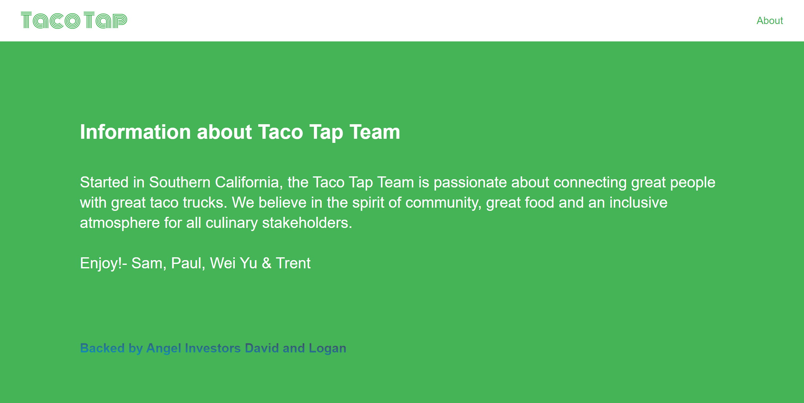
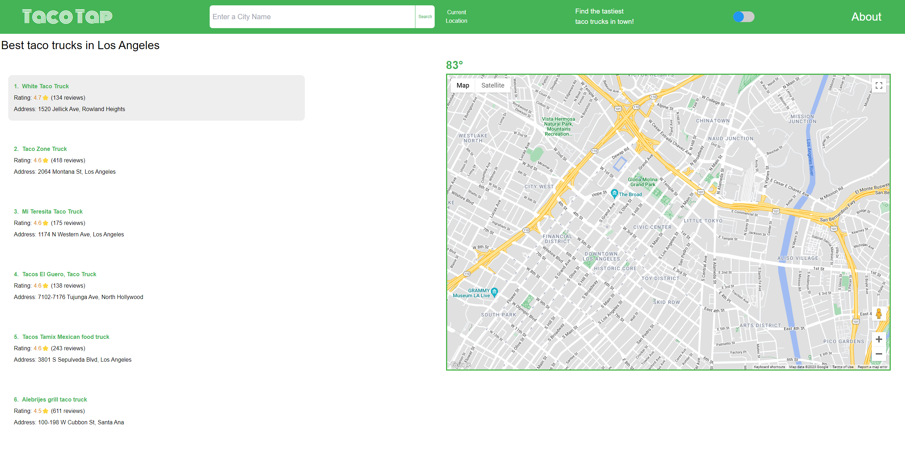

# Taco-Tap

Description:
Taco Tap is web application that allows you to find the top 10 food trucks, with a 4 star or better rating, based on the location entered.

## How to use:

Step 1 - Navigate browser to ($deployedWebsiteURL)
[[Insert screenshot]]

Step 2 - Input City or Address to serve as a base point for the search of nearby taco trucks
[[insert screenshot]]

Step 3 - Use the information as you see fit to plan your next taco truck meal
[[insert screenshot]]

Step 4 - Visit the About page to learn more about the Taco Tap team and our investors

## Technologies Used:

Figma - wireframing and designing the web application

Trello - project management and KANBAN board tracking of issues for Scrum meetings

HTML - Framework of application

TailwindCSS - Styling of application

Javascript - Logic of application

Google Maps API - Location of the taco trucks

OpenWeatherMap API - Geo services

[Live URL](https://captaineb.github.io/Taco-Tap/)

## Here are some screenshots:

## 

## 

## 

